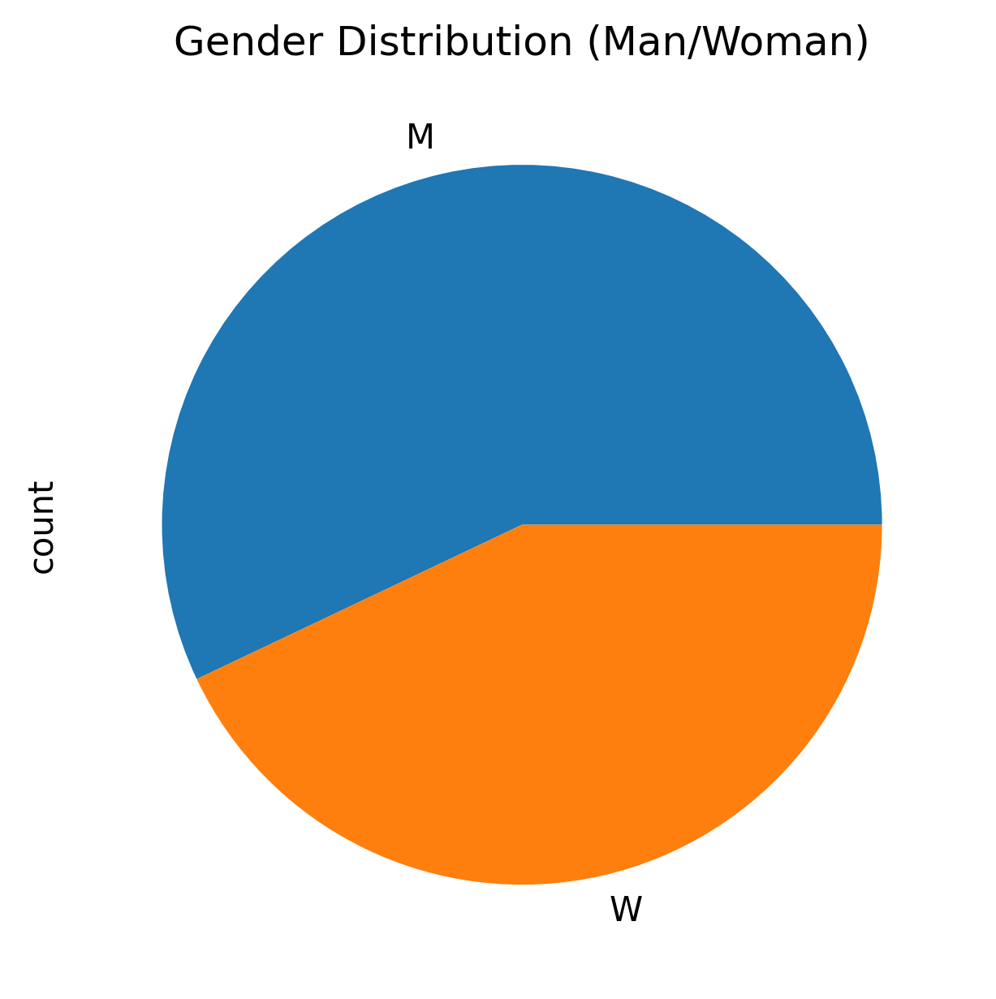
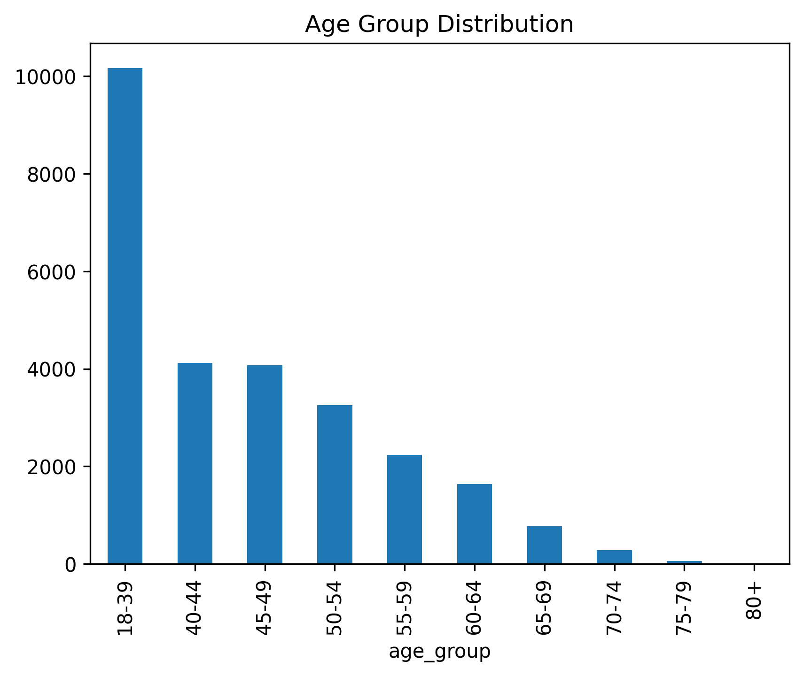
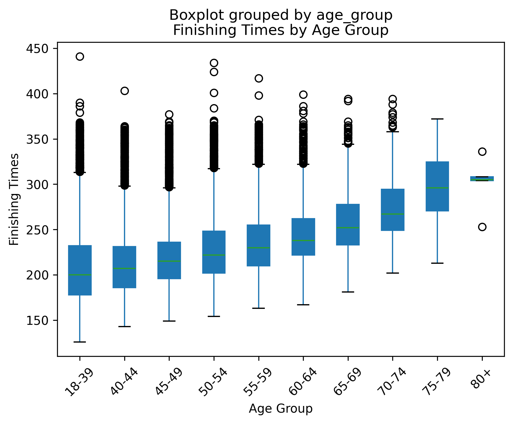
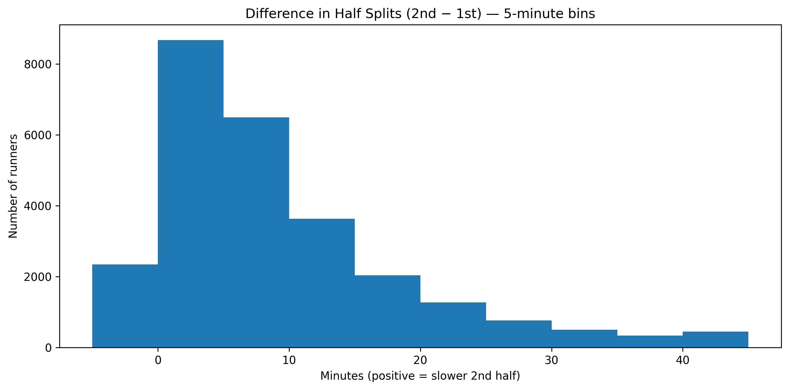

# 2023 Boston Marathon Analysis

## Objective
For this project I took data form the 2023 Boston Marathon and analyzed it using Python with a goal of analyzing and understanding
performance trends.

## Data
The dataset I used included info from over 26,000 participants with fields for gender, age, finishing time, halfway time

## Methodology 
To be able to use the data, I handled missing values, and convert time variables to minutes. I grouped participants by gender
and age, and use visualizations to identify patterns.

## Key Findings
### Gender Differences
Looking at gender distribution, slightly more men participated in this race than women. This difference isn’t dramatic, but it highlights an interesting opportunity for historical comparison 
it would be fascinating to analyze data from previous decades, dating back to 1967, to observe how women’s participation in marathons has grown over time.

### Age Group Distribution
The data shows that the largest age group of participants is between 18–39 years old, accounting for more than twice as many runners as any other age group. There’s a clear trend that as age increases, the number of participants steadily declines a reflection of how endurance events like marathons tend to attract younger to mid-aged runners.

### Finishing Times
This graph shows the distribution of finishing times of the different age groups. A trend is that the older groups run slower, 
the median slowly goes up. It also should be known the Boston Marathon has qualifying times which I believe keeps the average
completion time down. 

### Half Split Difference
This graph was the most interesting to me. This shows the difference in times between the second half of the marathon and the first half. 
It is worth noting how many people had a slower second half compared to the first. There also appears to be trend showing that most people did not
differ much as most of the people were only slower by around 15-20 minutes.

